# Rex-Dash

Rex Dash is an endless sidescroll game, the purpose of it is to collect the meat that fly across the screen and to dodge the enemy egg characters,
this game was designed for anybody of any age to play! it is fully optimised for PC and mobile devices alike and is intented for audiences of all backgrounds.

## Live deployment

The final project that is stored on gitHub is located [here](https://liamedwards931.github.io/JavascriptProject/)

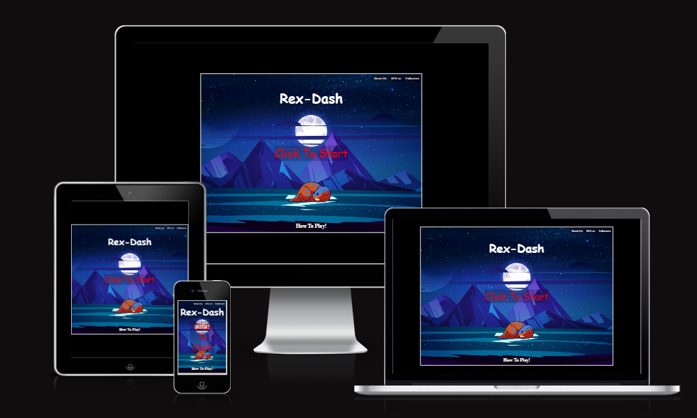

## Contents

- [Title](#rex-run)
- [Live deployment](#live-deployment)
- [User Experience](#user-experience)
- [Inspiration](#inspiration)
- [Site structure](#site-structure)
- [Design choices](#design-choices)
- [Features](#features)
  - [Index page](#index-page)
  - [Instructions page](#instructions-page)
  - [Game canvas](#game-canvas)
  - [Game over](#gameover)
- [Main Functions](#main-functions-for-the-game)
  - [Controls](#controls)
  - [creating the characters](#creating-the-characters)
  - [Collision detection](#collision-detection)
  - [Object spawning](#object-spawning)
  - [Parallax background](#parallax-background)
  - [Main game loop](#main-game-loop)
- [Technology Used](#technology-used)
- [Testing](#testing)
    - [Validator testing](#validator-testing)
    - [Bugs](#bugs)
    - [Lighthouse score](#lighthouse-score)
- [Deployment](#deployment)
- [Cloning](#cloning-repository)
- [Credits](#credits)
- [Acknowledgements](#acknowledgements)

## User experience

- As a user I would expect a title screen for the game.
- As a user I would expect there to be some instructions on the purpose of the game.
- As a user I would expect there to be some instructions on the controls for the game.
- As a user I would expect there to be some control of the Audio that is played e.g. a mute button.
- As a user I would expect the game to be simple to understand and play, with pleasing visuals.
- As a user I would expect smooth gameplay.
- As a user I would expect the game to not be too difficult that it is not fun, but challenging enough to make it enjoyable.
- As a user I would expect to see an increase in difficulty as I progress.
- As a user I would expect to see what my scores were when the game has ended.

  [home](#rex-dash)

  ## Inspiration

- Rex dash was inspired by my love of games and my curiosity into creating web based games using html5, CSS and javascript, this led me to researching and looking at other projects that had been created by other developers and inspired me to make my own.
  - Rex dash was inspired by my own personal fondeness of the jurassic era, and I thought it would be great to be able to make a game to reflect that fondness.
  - The entire project inspiration was based around a spritesheet I had found online of the orange T-rex and rex-dash was born from that.
  - I mapped out the features of the game and the general style I was going for with notepad on my desktop, and implemented piece by piece by adding the media and images I thought would fit well with the style I was looking to create.

[home](#rex-dash)

## Site Structure

- Rex-dash is composed of 2 pages of HTML.
- The first html is the index page, the starting page for the user - this page let's you navigate to the "how to play" which is the second html page.
- The div element is placed in the center of the screen as is the HUB for the game, it allows you to click to play, toggle mute and takes you to the instructions page.
- the canvas element is placed also in the center of the screen with the exact same dimensions as the div but in JS will only become active once click to play is selected.
- There is no need for a header or footer as all the navigation elements are within the div which is completely compliant with mobile users.

[home](#rex-dash)

## Design choices

- the background of the index page is plain black as I wanted all the user attention to be on the div in the center
  - within the index page the background is the rex character sleeping under the background image of the game, this blue let's me contrast the links well and makes them easy to read.
  - the links all have black slightly transparant backgrounds with white text, so it's obvious they are there but doesn't take away from the main function of clicking to play.
  - the how to play link on PC has a hover color change to red to show users that they can click the text to see how to play the game.
- the background of the instructions page is exactly the same as the index page, this is done intentionally so it seems seamless between the two pages.
  - this style is also exactly the same dimensions as the canvas and the div element, so they all work identically on any device.

[home](#rex-dash)

## Features

### Index Page

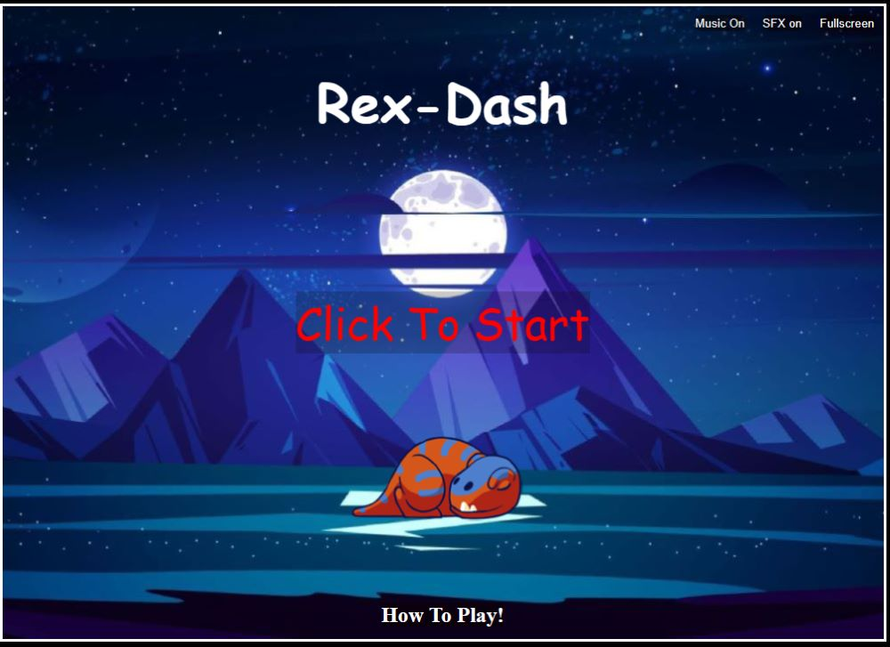

- Mute buttons on the index page
  All font-styles used in this project are 'cursive'

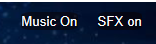

There are two different mute functions available to the user so they have the choice to play with or without music and with or without sound effects or with or without sound effects and music.
this was designed for a more user friendly experience as it gives them more control over what audio is played when playing the game.

- Full screen button on the index page

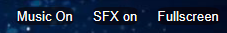

The full screen button is exactly the same style as the mute buttons for consistency, all of these buttons are located in the top right corner of the index page so they do not take away from the main click to play function.

- How to play link

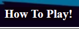

The how to play button is larger than the other buttons as I wanted to draw attention to this a little more so users know where to go to find out how they can play the game and the purpose of the game itself. - how to play link CSS

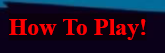

When hovered over on pc the how to play changes color to red to emphasise to the user that this is a link to be pressed.

- Click to start

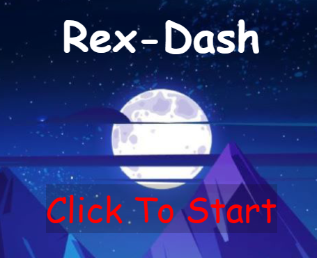

The click to start button is located in the middle of the screen with the largest font, this also has a different color to the rest of the text to really drive the point that this is the place to click to start the game.

[home](#rex-dash)

### Instructions page

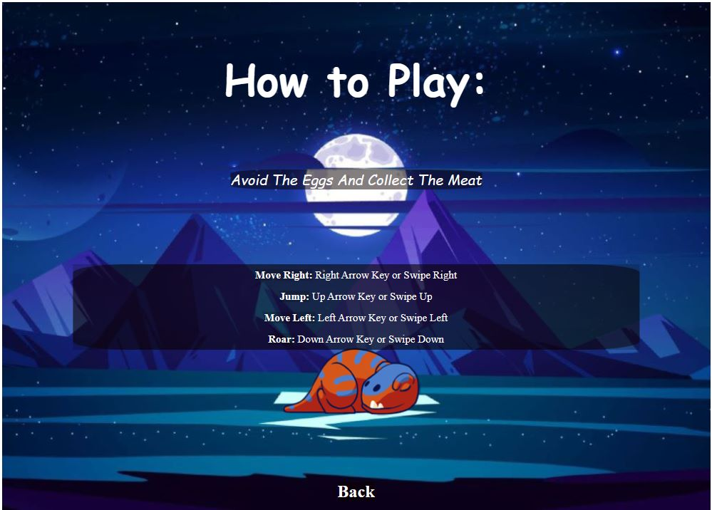

The instruction page has the main purpose of the game in the middle of the page with the instructions on how to play just underneath, they both have styling white color with a slight transparent black background for emphasis, this page also has the same position and styling for the back button as the how to play button to keep the consistency.

[home](#rex-dash)

### Game Canvas

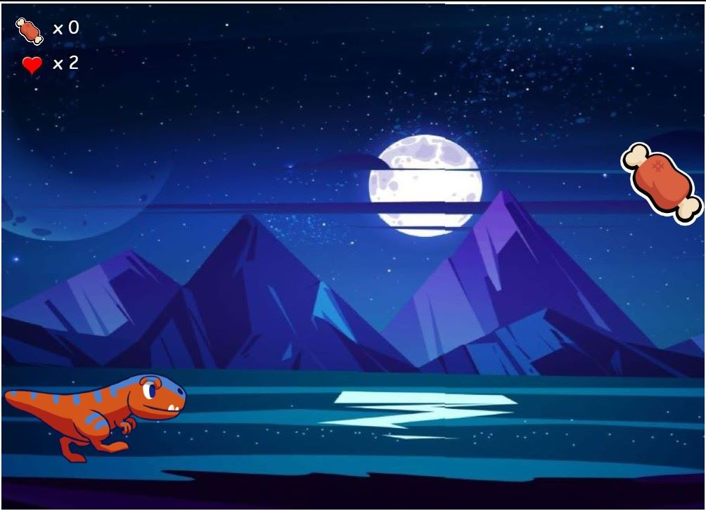

- Game canvas has your player character 'Rex' starting on the left edge of the screen.
- The score and your HP are both displayed in the top left corner, this symbolises the "meat" you have collected and the lives you have remaining
  - These are in place to make sure they are visible but not too distracting of the game
- The game music plays as soon as you enter the canvas from the index screen, this can be turned off by pressing the "Music On" button which JS will change the innner.HTML to "Music OFF" this represents the current state of the Audio.
- Sound effects are activated on ArrowDown, on collision with Egg and on collision with meat, these also can be muted by pressing "SFX on" button, this will in JS change the inner.HTML to "SFX off" this represents the current state of the SFX audio.
  - Arrow Down sound effect - Makes the character do a T-rex roar
  - on collision with egg sound effect - A growl.
  - On collision with meat object - a snarl.
- Egg enemies and Meat objects will come at different intervals from the left edge of the screen they spawn progressively quicker the more meat you collect. (difficulty feature)
  - Meat will spawn at different Y co-ordinates on the map but will never overlap the egg enemies, this gameplay feature is to make the game more friendly.
- controls for this game are tailored to both PC and Mobile users.

[home](#rex-dash)

### Gameover

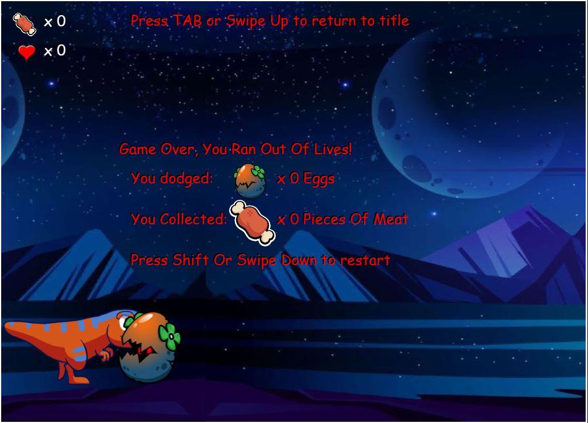

- Game over activates when player loses 5 of their lives.
- On game over it tells you how you lost, displays the amount of meat collected, the amount of eggs you have evaded, how to return to title and how to restart the game.
- I have added all the text twice to create a shadow effect to make the text stand out a little better, so users can see it clearly in the center of the screen.
- On Reset this also returns the music back to it's original starting point at 0;

[home](#rex-dash)

## Main functions for the game

### Controls

- PC keyboard
  - Created a class constructor so it can be called later to move the rex character.
  - Within the controls I created an empty Array.
  - Added an event listener for 'keydown' and 'keyup' - key down to push the key into the array only if it is not already in there and keydown to splice that value out of the Array again.
  - The shift to restart and the tab to return to the title but only if it's game over are called in these event listeners also.
- Mobile
  - Added 2 empty string variables for X co-ordinate and Y co-ordinate representing their starting points.
  - Added threshhold for these touches to register a move e.g min 30px swipe to make character jump.
  - Added 3 event listeners 'touchstart' 'touchmove' 'touchend'
  - in 'touchstart' I declare the value of the variables with the empty strings: this.touchY = a.changedTouches[0].pageY; - this is taken from Dev tools and shows you where you have initiated a click on the Y axis. did the same for the X axis.
  - in 'touchmove' I declare a variable and calculate the distance of the swipe by using: const swipeDist = a.changedTouches[0].pageY - this.touchY; do the same for X co-ordinate;
  - Create an if statement that registers if a swipe has been done upwards the '-this.touch' is the verticle threshhold of the page:
    if (swipeDist < -this.touchThreshhold && this.keys.indexOf('swipeUp') === -1) - this then behaves the same way the arrow keys did . pushes into array and splices the array in 'touchend'.
- These controls get called in a later class constructor for the Rex character.

[home](#rex-dash)

### Creating the characters

- Rex character

  - Added a class constructor, this constructor had 2 arguments to call it (game.width, game.height) this is the canvas width and height
  - SRC of the image you want to use as the character.
  - Declared the x and y positions of the character
  - Declared to width and height of the character - the math for this is spritesheet image pixel width / amount of sprites in row & image pixel height / amount of sprites in column.
  - Declared the frame position of the character i.e which part of the sprite sheet the animation will start from (usually 0) + do code to animate later.
  - Declare frameInterval - how many images in a line on the sprite sheet
  - Declare frameTimer - how quickly it jumps between animations.
  - FPS of the character (animation speed)
  - Because the character jumps we added velocity aka jump height
  - Because the character jumps we added gravity variable
  - Because the rex moves we also add a speed variable.
  - The different sound effects added to the T-rex are declared here also.
  - it has 3 other functions inside of the class:
    - restart() - when the game is restarted the code in this function will run which in this case reset the rex back to it's original start point on the canvas
    - draw(context) - we add an argument because this is creating an object we want it to be drawn on the context variable which for this project is context('2d)
    - (context.drawImage(image, Source X, Source Y , Source width, Source Height) - the first 5 arguments for the draw image are basically telling us what to crop out on the sprite sheet.
      - Source X + Y - where to start cropping the sprite sheet.
      - Source width + height - how big to crop.
    - This is followed by another 4 arguments(destination x, destination y, destination width , destination height)
      - destination x and Y - where to place the cropped image.
      - destination width and height - how big to make the cropped image
    - The ground work here for beginning the animation is to multiply the cropped X position by this.frameX in the drawImage();
    - This is then animated in the update(); method which you can see in the [Javascript Code](https://github.com/LiamEdwards931/JavascriptProject/blob/main/assets/javascript/script.js)

- This technique is repeated for the Eggenemy and Meat objects.

[home](#rex-dash)

### Collision detection

- Collisions in this game are detected by seeing if two circles have collided.
  - I calculated this by using pythagoras theory to calculate the hypotenuse between the two circles to calculate the distance between them and to see if they overlapped at any point + if they did it reduced the hp of your character by 1;
  - you can see more comments on this within the code itself. [Javascript Code](https://github.com/LiamEdwards931/JavascriptProject/blob/main/assets/javascript/script.js)
  - the code for what happens on a collision with eggs and meat is found in the update() method of the rex char

## Object Spawning

- Created two variable empty arrays at the top of the file
- Created variables for:
  - intervals - how often the enemy/ meat will spawn
  - timer - how long it takes since the last time something spawned.
- function to spawn the enemies was created:
  - the basics of it are: a timer will count up to the interval and push an enemy into the empty array when it does so.
  - the update method triggers in the class we created for the enemy that deletes the enemy once it has left the 0 co-ordinate of X
- This is also repeated for the meat objects.

## Parallax background

- Created the background with a class constructor.
- Declared to images in the draw() function.
    - image 1 with the original ratio.
    - image 2 with the same ratio but it's x position is after image 1 
- In the update() function I add the speed to x position of image 1 to make it move to left screen to create the visual of the background moving
- I reset the position of image 1 when image 2 hits the 0 co-ordinate of X

## Main game loop

- The main game loop has all the draw(), update() methods
- the game is looped by using: requestanimationframe(animate) <- last part is the functions' name.
- it also uses deltaTime which is used to keep time consistent across devices.
- I have specified how to calculate this in the comments next to the gameLoop in the script file.

[home](#rex-dash)

## Technology used

- Code is written using Tab key spacing on:
  - Html,
  - CSS
  - Javascript.
- Images were edited in:

  - Photoshop

  [home](#rex-dash)

## Testing

- Code was tested on Microsoft Edge, FireFox and Google Chrome browser.
- Testing involved running the game loop and looking at bugs with the web development tools the following criteria have all been tested:
  - Tested Player Rex for hit markers, jump height, animation speed, "gravity" factor to bring rex back down, move left + right speeds, and SFX on Arrow down for the rex roar,found some bugs that are documented in the [bugs](#bugs) section of the README. All tested for PC use and Mobile use.
  - Tested eggEnemy intervals to make sure the game was beginner friendly, had a friend who is inexperienced at games to play to see if the game was intuitve and easy to play.
  - tested the difficulty increase to ensure that the code was in fact increasing the spawn rate of enemies as you collected more Meat objects.
  - Tested Meat collection to ensure that it was collecting properly and increasing the meatCollected score and playing the correct SFX on collection.
  - Tested background to ensure that the scroll speed and "parralax effect" is working correctly.
  - Tested GameOver to ensure that it activates when hp value reached 0.
  - Tested restartGame to enure that when shift is pressed when it is gameOver the game restarts from beginning.
  - Tested Mute function and ensured that all sounds are muted when button is clicked.
  - Tested fullscreen function and ensured that when clicked both the title screen and the canvas both went into the full screen state.
  - had issues with the movement on phone not registering swipe left and right during a swipe up jump (fixed) - this.touchX was registered as variable twice and was resetting initial swipe position instead of registering a swipe.

### Responsive testing

- Rex-dash has been tested on all mobile devices and runs 
- Iphone
    - Verticle

    

### Validator testing

- No errors returned when code was run through the [HTML W3C validator](https://validator.w3.org/nu/?doc=https%3A%2F%2Fliamedwards931.github.io%2FJavascriptProject%2F)

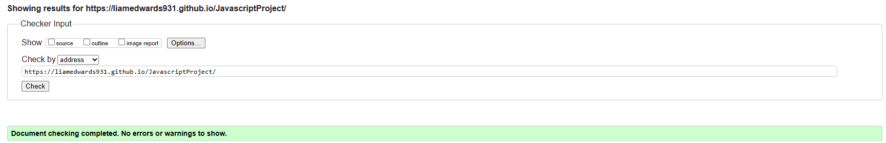

- No errors returned when code was run through the [CSS jigsaw validator](https://jigsaw.w3.org/css-validator/validator?uri=https%3A%2F%2Fliamedwards931.github.io%2FJavascriptProject%2F&profile=css3svg&usermedium=all&warning=1&vextwarning=&lang=en)

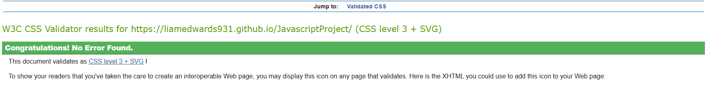

- All warnings on JShint say along the lines of "'const' is available in ES6 (use 'esversion: 6') or Mozilla JS extensions (use moz)."

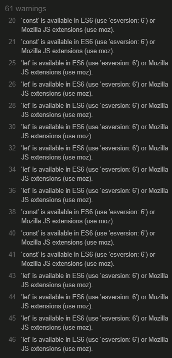

[home](#rex-dash)

### Bugs

- Array for the keys wasn't deleting the key after input (fixed) - There was a typo on splice method and was spelt 'spilce'
- Player Rex character would float back to the left edge of screen after continuous key presses (fixed) - was a result of a missing bracket on the event listener in the If statement for the keydown.
- Player character wasn't animating correctly (fixed) - was missing a statement to reset frame interval back to 0 after it had stopped counting.
- Meat was incrementing the score by 20 each time collected (fixed) - was missing a second statement to remove the meat after it had been collected.
- Meat was being collected without a collision (fixed) - removed the division from the this.x and this.y in the meat collision calculation.
- the Y axis position of the rex wasn't being calculated correctly in the collision detection (fixed) - adjusted the y axis formula to correctly mark where the rex was sitting on the canvas.
- enter key wasn't working to reset the game on gameOver (fixed) - set the wrong variable for rexchar in the gameOver function, changed it back to normal to make it work.
- Changed the reset game button to shift as there was a problem with the mute button activating when game was resetting.
- canvas and title screen jumped when swiping on mobile (fixed) - set the CSS property of canvas and title screen to "touch-action:none".
- When fullscreen button was clicked it would only go to fullscreen on the Canvas (fixed) - set the property the fullscreen was looking for to the window of the document and not the canvas specifically.
- Bug where back to title screen button would keep the canvas in the same state it was when button was pressed (fixed) - set the same values as restart game minus the animate(0) call to reset everything when back to home.

[home](#rex-dash)

### Lighthouse score

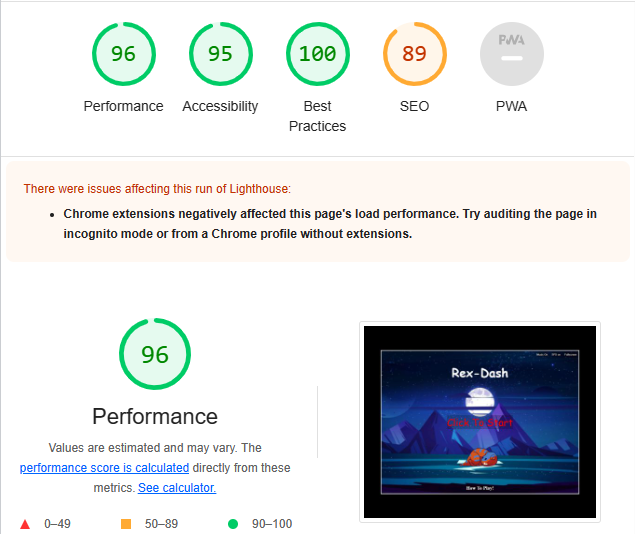

[home](#rex-dash)

## Deployment

- This site was deployed through Github pages the steps to do so are as follows:
  1. Go to repository of the website you are working on.
  2. Go to the settings option.
  3. Scroll down to the pages section on the left hand side.
  4. Select the main branch to deploy.
  5. Github will give you the live link for your webpage.
  - The live site can also be reached here: [Rex-Dash](https://liamedwards931.github.io/JavascriptProject/)
  - The repository for this site can be reached here: [Rex-Dash repository](https://github.com/LiamEdwards931/JavascriptProject)

[home](#rex-dash)

## Cloning repository

1. On your GitHub repository navigate to your repository page.
2. Click on the green button with "CODE" written in it.
3. Go to the HTTPS and copy the URL by pressing the overlapping squares.
4. Open Git Bash.
5. Enter git clone followed by the copied URL.
6. Enter where you would like your repository to be saved too for your local file.
7. Press Enter to finalise the clone.

[home](#rex-dash)

## Credits

- T-rex spritesheet was taken from [pngkey](https://www.pngkey.com/download/u2e6o0o0o0w7w7a9_dinosaur-trex-dino-sprite-sheet/)
- Egg enemy character was taken from [bevoulin](https://bevouliin.com/category/game-asset/game-characters/page/3/)
- Audio for rex was taken from [pixabay](https://pixabay.com/sound-effects/search/t-rex/)
- Audio for collecting the meat was taken from[Memozee](http://animal.memozee.com/animal/SOUND/JurassicPark-Tyrannosaurus_rex-Roaring.wav)
- Audio for getting hit by the eggs was taken from [Film Masters](https://www.youtube.com/watch?v=b3NYvwd8vBI)
- The meat image was taken from [superautopets](https://superautopets.fandom.com/wiki/Meat_Bone)
- the heart image was taken from [etsy](https://etsy.com)
- Audio for title screen and Game run was taken from [PixaBay](https://pixabay.com/music/search/dinosaur/)
- Animation techniques/Movement techniques were learned from Youtube [Franks Laboratory](https://www.youtube.com/watch?v=GFO_txvwK_c)

[home](#rex-dash)

## Acknowledgements

- Rex-Run is a completely free to play game for anyone who wishes to play it, all content used within this media is NOT for commercial use, this game was designed with no intent to distribute for profit. Any similarities between the style of Rex-Run and any other game are completely co-incedental.
- This project was created for the level 3 diploma Full Stack Developer with the [Code Institute](https://codeinstitute.net/full-stack-software-development-diploma/?utm_term=code%20institute&utm_campaign=CI+-+UK+-+Search+-+Brand&utm_source=adwords&utm_medium=ppc&hsa_acc=8983321581&hsa_cam=1578649861&hsa_grp=62188641240&hsa_ad=635720257674&hsa_src=g&hsa_tgt=kwd-319867646331&hsa_kw=code%20institute&hsa_mt=e&hsa_net=adwords&hsa_ver=3&gad=1&gclid=CjwKCAjw67ajBhAVEiwA2g_jEKYbx7CDH4ExZGh3udf-5qh-Ee91R2MXr7F5M4UdbdDhV-c-QZ-_zxoCyW4QAvD_BwE)
- [Precious Ijege](https://www.linkedin.com/in/precious-ijege-908a00168/) for the constructive feedback with my milestone project.

Liam Edwards 2023.

[home](#rex-dash)
