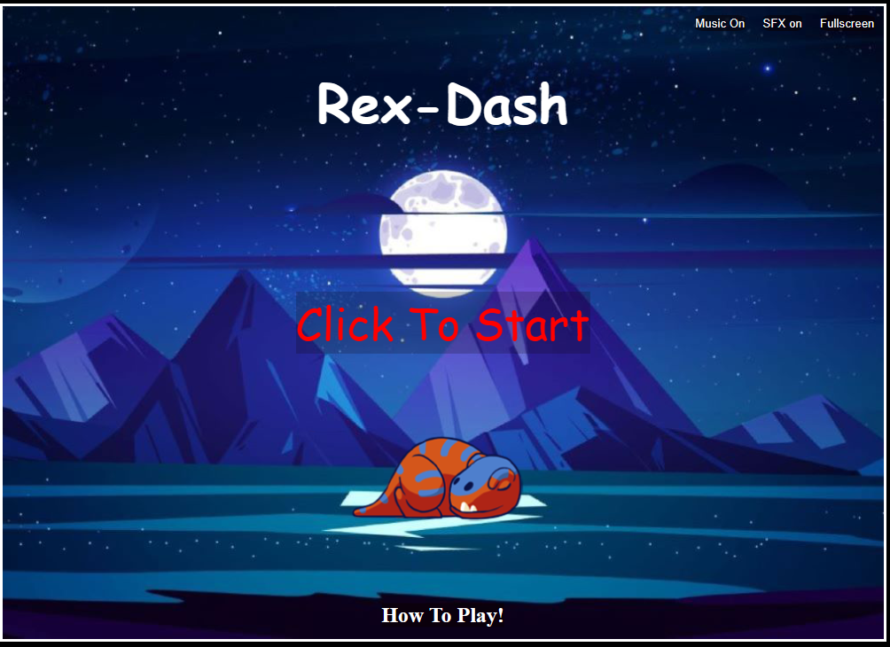

# Rex-Dash

Rex Dash is an endless sidescroll game, the purpose of it is to collect the meat that fly across the screen and to dodge the enemy egg characters,
this game was designed for anybody of any age to play! it is fully optimised for PC and mobile devices alike and is intented for audiences of all backgrounds.

## Live deployment

The final project that is stored on gitHub is located [here](https://liamedwards931.github.io/JavascriptProject/)

## Contents

- [Title](#rex-run)
- [Live deployment](#live-deployment)
- [Markup](#markup)
- [User Experience](#user-experience)
- [Inspiration](#inspiration)
- [Site structure](#site-structure)
- [Design choices](#design-choices)
- [Features](#features)
- [Testing](#testing)
- [Bugs](#bugs)
- [Credits](#credits)

## Markup

- Code is written using Tab key spacing on Html, CSS and Javascript.
  
  [home](#rex-dash)

## User experience

- As a user I would expect a title screen for the game.
- As a user I would expect there to be some instructions on the purpose of the game.
- As a user I would expect there to be some instructions on the controls for the game.
- As a user I would expect there to be some control of the Audio that is played e.g. a mute button.
- As a user I would expect the game to be simple to understand and play, with pleasing visuals.
- As a user I would expect smooth gameplay.
- As a user I would expect the game to not be too difficult that it is not fun, but challenging enough to make it enjoyable.
- As a user I would expect to see an increase in difficulty as I progress.
- As a user I would expect to see what my scores were when the game has ended.
  
  [home](#rex-dash)

  ## Inspiration

- Rex dash was inspired by my love of games and my curiosity into creating web based games using html5, CSS and javascript, this led me to researching and looking at other projects that had been created by other developers and inspired me to make my own. 
    - Rex dash was inspired by my own personal fondeness of the jurassic era, and I thought it would be great to be able to make a game to reflect that fondness. 
    - The entire project inspiration was based around a spritesheet I had found online of the orange T-rex and rex-dash was born from that. 
    - I mapped out the features of the game and the general style I was going for with notepad on my desktop, and implemented piece by piece by adding the media and images I thought would fit well with the style I was looking to create. 

[home](#rex-dash)

## Site Structure

- Rex-dash is composed of 2 pages of HTML.
- The first html is the index page, the starting page for the user - this page let's you navigate to the "how to play" which is the second html page. 
- The div element is placed in the center of the screen as is the HUB for the game, it allows you to click to play, toggle mute and takes you to the instructions page.
- the canvas element is placed also in the center of the screen with the exact same dimensions as the div but in JS will only become active once click to play is selected.
- There is no need for a header or footer as all the navigation elements are within the div which is completely compliant with mobile users.

[home](#rex-dash)

## Design choices 

- the background of the index page is plain black as I wanted all the user attention to be on the div in the center
    - within the index page the background is the rex character sleeping under the background image of the game, this blue let's me contrast the links well and makes them easy to read. 
    - the links all have black slightly transparant backgrounds with white text, so it's obvious they are there but doesn't take away from the main function of clicking to play.
    - the how to play link on PC has a hover color change to red to show users that they can click the text to see how to play the game. 
- the background of the instructions page is exactly the same as the index page, this is done intentionally so it seems seamless between the two pages. 
    - this style is also exactly the same dimensions as the canvas and the div element, so they all work identically on any device.

[home](#rex-dash)

## Features

### Index Page 

- Mute buttons on the index page

There are two different mute functions available to the user so they have the choice to play with or without music and with or without sound effects or with or without sound effects and music.
this was designed for a more user friendly experience as it gives them more control over what audio is played when playing the game. 

- Full screen button on the index page

The full screen button is exactly the same style as the mute buttons for consistency, all of these buttons are located in the top right corner of the index page so they do not take away from the main click to play function.

- How to play link

The how to play button is larger than the other buttons as I wanted to draw attention to this a little more so users know where to go to find out how they can play the game and the purpose of the game itself.
    - how to play link CSS

When hovered over on pc the how to play changes color to red to emphasise to the user that this is a link to be pressed.

- Click to start 

The click to start button is located in the middle of the screen with the largest font, this also has a different color to the rest of the text to really drive the point that this is the place to click to start the game

## Testing

- Code was tested on Microsoft Edge, FireFox and Google Chrome browser.
- Testing involved running the game loop and looking at bugs with the web development tools the following criteria have all been tested:
  - Tested Player Rex for hit markers, jump height, animation speed, "gravity" factor to bring rex back down, move left + right speeds, and SFX on Arrow down for the rex roar,found some bugs that are documented in the [bugs](#bugs) section of the README. All tested for PC use and Mobile use.
  - Tested eggEnemy intervals to make sure the game was beginner friendly, had a friend who is inexperienced at games to play to see if the game was intuitve and easy to play.
  - tested the difficulty increase to ensure that the code was in fact increasing the spawn rate of enemies as you collected more Meat objects.
  - Tested Meat collection to ensure that it was collecting properly and increasing the meatCollected score and playing the correct SFX on collection.
  - Tested background to ensure that the scroll speed and "parralax effect" is working correctly.
  - Tested GameOver to ensure that it activates when hp value reached 0.
  - Tested restartGame to enure that when shift is pressed when it is gameOver the game restarts from beginning.
  - Tested Mute function and ensured that all sounds are muted when button is clicked.
  - Tested fullscreen function and ensured that when clicked both the title screen and the canvas both went into the full screen state.
  - had issues with the movement on phone not registering swipe left and right during a swipe up jump (fixed) - this.touchX was registered as variable twice and was resetting initial swipe position instead of registering a swipe.

[home](#rex-dash)

## Bugs

- Array for the keys wasn't deleting the key after input (fixed) - There was a typo on splice method and was spelt 'spilce'
- Player Rex character would float back to the left edge of screen after continuous key presses (fixed) - was a result of a missing bracket on the event listener in the If statement for the keydown.
- Player character wasn't animating correctly (fixed) - was missing a statement to reset frame interval back to 0 after it had stopped counting.
- Meat was incrementing the score by 20 each time collected (fixed) - was missing a second statement to remove the meat after it had been collected.
- Meat was being collected without a collision (fixed) - removed the division from the this.x and this.y in the meat collision calculation.
- the Y axis position of the rex wasn't being calculated correctly in the collision detection (fixed) - adjusted the y axis formula to correctly mark where the rex was sitting on the canvas.
- enter key wasn't working to reset the game on gameOver (fixed) - set the wrong variable for rexchar in the gameOver function, changed it back to normal to make it work.
- Changed the reset game button to shift as there was a problem with the mute button activating when game was resetting.
- canvas and title screen jumped when swiping on mobile (fixed) - set the CSS property of canvas and title screen to "touch-action:none".
- When fullscreen button was clicked it would only go to fullscreen on the Canvas (fixed) - set the property the fullscreen was looking for to the window of the document and not the canvas specifically.
- Bug where back to title screen button would keep the canvas in the same state it was when button was pressed (fixed) - set the same values as restart game minus the animate(0) call to reset everything when back to home.

[home](#rex-dash)

## Credits

- T-rex spritesheet was taken from [pngkey](https://www.pngkey.com/download/u2e6o0o0o0w7w7a9_dinosaur-trex-dino-sprite-sheet/)
- Egg enemy character was taken from [bevoulin](https://bevouliin.com/category/game-asset/game-characters/page/3/)
- Audio for rex was taken from [pixabay](https://pixabay.com/sound-effects/search/t-rex/)
- Audio for collecting the meat was taken from[Memozee](http://animal.memozee.com/animal/SOUND/JurassicPark-Tyrannosaurus_rex-Roaring.wav)
- Audio for getting hit by the eggs was taken from [Film Masters](https://www.youtube.com/watch?v=b3NYvwd8vBI)
- The meat image was taken from [superautopets](https://superautopets.fandom.com/wiki/Meat_Bone)
- the heart image was taken from [etsy](https://etsy.com)
- Audio for title screen and Game run was taken from [PixaBay](https://pixabay.com/music/search/dinosaur/)
- Animation techniques/Movement techniques were learned from Youtube [Franks Laboratory](https://www.youtube.com/watch?v=GFO_txvwK_c)

[home](#rex-dash)
